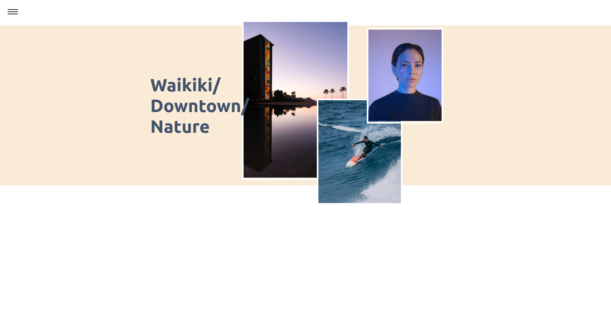

# Shanel Photography
Note: Site has moved over to use wordpress, this is left up for demonstration purposes

---

### [JAMstack](https://jamstack.org/) 
App built w/ Next.js front end framework connected to a digital ocean droplet w/ Directus CMS installed. Content pulled via API, documentation found (here)[https://v8.docs.directus.io/api/reference.html#projects]. Public domain www.shanelhonolulu.com. Password protected admin panel located at a secret sub-domain (secret as in I havn't documented it anywhere, it can probably be found w/ a web crawler).

Admin dashboard created with Directus headless CMS which allows for easy database management. This makes it easy for non-technical users to perform CRUD operations and manage their data. Connected to a Postgresql database.

### How Does the Directus API Work?
Directus uses (database mirroring)[https://www.sqlshack.com/sql-server-database-mirroring/] to generate APIs. More on Directus architecture (here)[https://docs.directus.io/getting-started/architecture/https://docs.directus.io/getting-started/architecture/].

### Database Structure
Since this is a photography website the main data fields that are important are the images, filenames, image descriptions and how sets of photos relate to one another. Photos on this site are related through a one-to-many relation with one header photo which leads to a set of related photos when clicked. 
